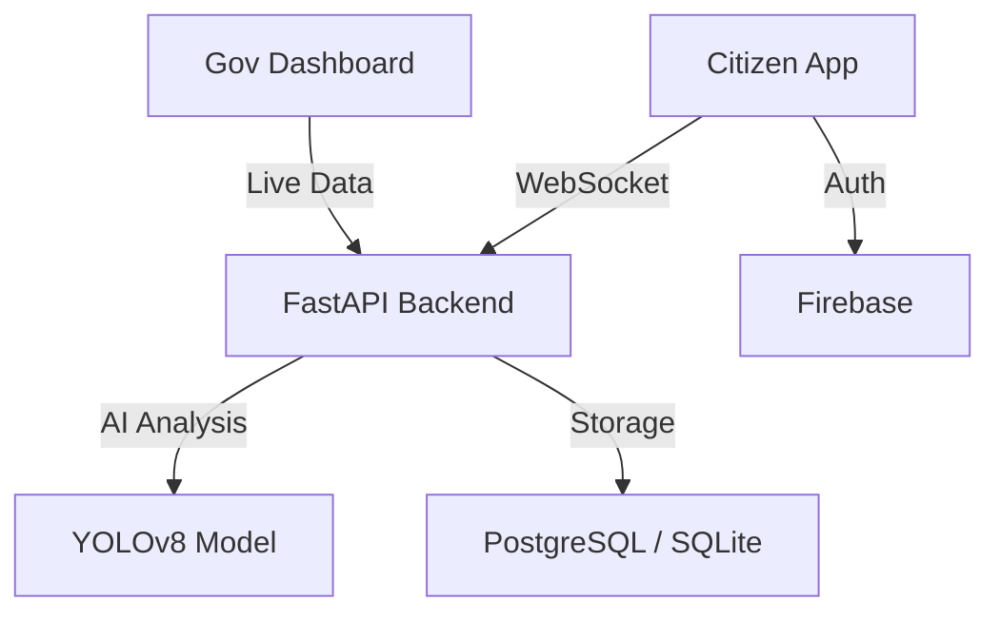

# AIPRDD: AI-Powered Road Damage Detection & Navigation System

[](https://github.com/ABHI200407/AIPRDD-AI_POWERED-ROAD-DAMAGE-DETECTION-SYSTEM)
[](https://github.com/ABHI200407/AIPRDD-AI_POWERED-ROAD-DAMAGE-DETECTION-SYSTEM)

**AIPRDD** (AI-Powered Road Damage Detection) is an enterprise-grade ecosystem designed to revolutionize road safety and infrastructure maintenance. By bridging the gap between citizen-driven data and municipal action, it turns every smartphone into a **Road Sentinel**.

---

## 📸 System Previews

| **Road Sentinel Elite (Mobile HUD)** | **Government Command Center** |
| :---: | :---: |
|  |  |
| *Continuous AI monitoring with impact verification.* | *Real-time city-wide infrastructure oversight.* |

---

## ✨ Elite Features

### 🛡️ Road Sentinel Elite
- **Storage-Less AI Pipeline:** Real-time YOLOv8 analysis performed entirely in RAM. Images are discarded instantly, saving terabytes of cloud storage.
- **Double-Verification (Sensor Fusion):** Correlates visual pothole detections with **Accelerometer G-Force spikes** to identify high-impact hazards that damage vehicles.
- **Stealth Mode:** Power-saving dimming feature for vehicle-mounted phones, preventing overheating while maintaining 24/7 scanning.

### 🗺️ Area-Aware Geolocation
- **Neighborhood Mapping:** Automatically translates GPS coordinates into human-readable zones like **Hitech City, Abids, and Secunderabad**.
- **Live Warning Network:** Broadcasts instant hazard alerts to nearby drivers using the app (e.g., *"Caution: Deep pothole detected 100m ahead!"*).

### 🏛️ Government Command Center
- **AI-Ranked Priority Queue:** Hazards are automatically sorted by severity, traffic density, and impact verification.
- **Predictive Deterioration:** Monitors defects over time and flags those growing rapidly for early, cost-effective repair.
- **Area Filtering:** Filter city-wide damage by neighborhood to optimize crew dispatch.

---

## 🛠️ Technology Stack



- **AI/Vision:** YOLOv8, OpenCV, Perceptual Hashing.
- **Backend:** FastAPI (Python 3.10+), SQLAlchemy, SlowAPI (Rate Limiting).
- **Frontend:** React 18, Vite, Leaflet, Lucide Icons.
- **Infrastructure:** Gunicorn, WebSockets, Firebase Admin SDK.

---

## 🚀 Quick Start

### 1. Backend Setup
```bash
# Clone and enter directory
git clone https://github.com/ABHI200407/AIPRDD-AI_POWERED-ROAD-DAMAGE-DETECTION-SYSTEM.git
cd AIPRDD-AI_POWERED-ROAD-DAMAGE-DETECTION-SYSTEM

# Install dependencies
pip install -r requirements.txt

# Configure .env (See .env.example)
# Run the production-ready server
python main.py
```

### 2. Frontend Setup
```bash
# Citizen App
cd frontend/citizen-app && npm install && npm run dev

# Government Dashboard
cd frontend/gov-dashboard && npm install && npm run dev
```

---

## 📄 License
This project is licensed under the MIT License - see the [LICENSE](file:///c:/Users/coding/Desktop/PROJECT/rd/LICENSE) file for details.

---
*Developed for a safer, smarter, and smoother urban commute.*
